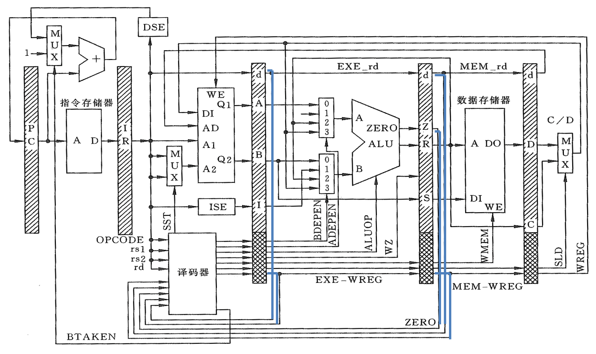
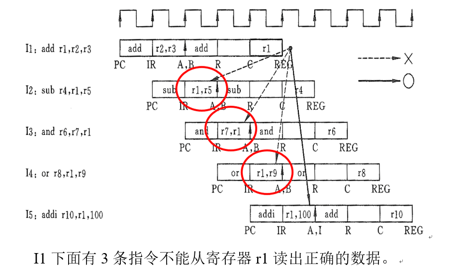

# computer-architecture

# 数据冒险
<b>定义：</b>  
由于流水线上指令重叠执行，改变了原来串行执行的读/写操作数顺序，使得后面依赖前面指令结果的指令得不到准备好的数据，这样的现象叫做数据冒险（数据相关）。如下图所示：
  
<b>解决方案：</b>  
1、暂停流水线：  
暂停流水线到最初的指令执行完毕，可以解决数据冒险，但是会涉及到两个问题，即“如何检测出数据冒险”和“如何暂停流水线”。  
2、内部前推技术：  
数据相关本质：一条指令执行时要用到上面指令的计算结果，但这个结果尚未被写入寄存器堆。而实质上，此时结果已经由ALU计算出来了，在流水线寄存器R和C中。  
由此，我们可以在ALU的两个数据输入端各加一个多路器，使R和C中的数据能被直接送到ALU的输入端，这就是所谓的内部前推。  
3、load指令的处理——暂停与内部前推相结合：  
load指令在EXE级结束后，还在忙着访问存储器。在MEM级结束后，结果才出现在流水线寄存器D中，见下图。这时，即使使用内部前推技术也无法消除load指令与它的下一条相关指令之间的第一个“气泡”。

# 控制冒险
<b>定义：</b>指令部件使用的冲突  
<b>解决方案：</b>  
1. 修改流水线代码，增加控制冒险检测模块、暂停流水线功能模块，以解决控制冒险问题。并在流水线结构图中作出相应修改。
2. 设计一个含有控制冒险的指令序列（包括无条件转移指令与条件转移指令），将其添加到修改后CPU代码的指令存储器中，对其进行仿真，验证代码的正确性。
